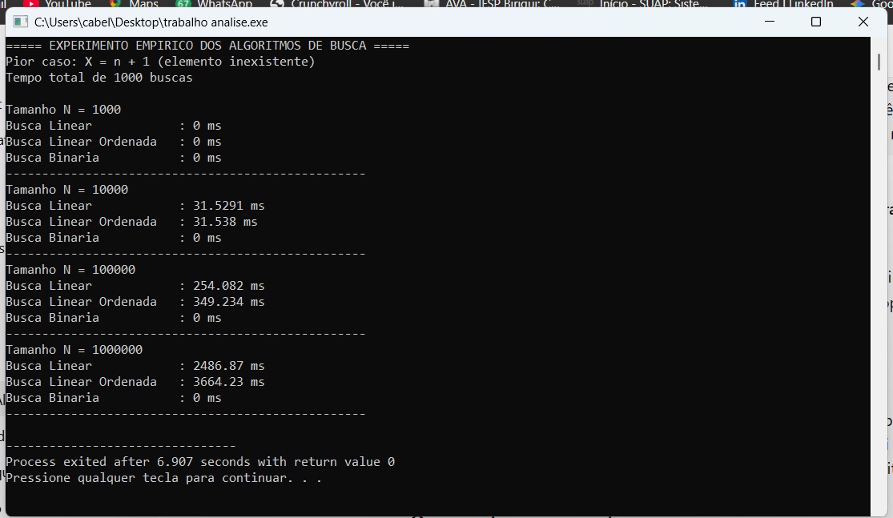
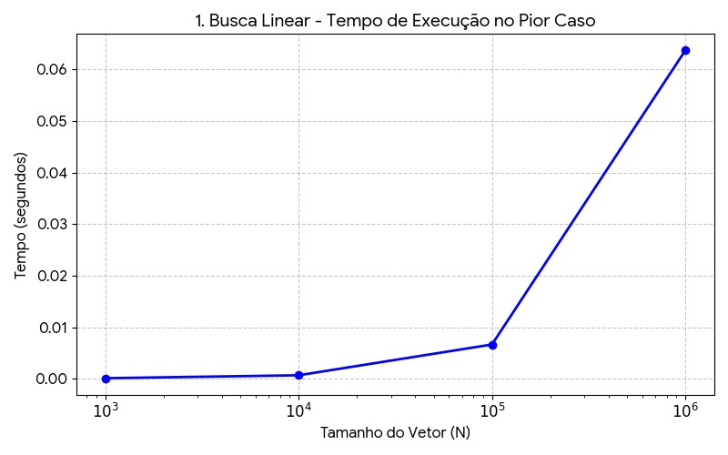
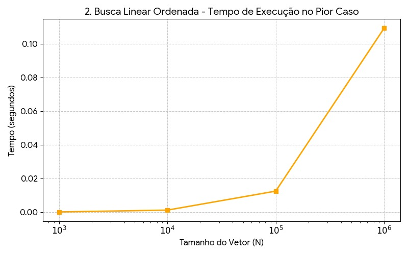
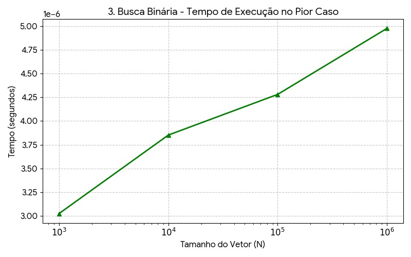

# Projeto: Análise e Complexidade de Algoritmos

Este projeto foi desenvolvido como parte da avaliação prática da disciplina de Análise e Complexidade de Algoritmos do IFSP Campus Birigui. O objetivo principal foi explorar os conceitos de análise assintótica, algoritmos de força bruta e estruturas de busca e ordenação.

## O que foi feito:
1. **Implementação de Algoritmos:** Desenvolvimento em C++ das funções de Busca Linear, Busca Linear em Vetor Ordenado, Busca Binária e o método de ordenação *Insertion Sort*.
2. **Provas Teóricas:** Demonstração formal da corretude da Busca Binária utilizando a técnica de *Invariante de Laço* e comprovação matemática de que o *Insertion Sort* possui complexidade $\Theta(n^2)$ no seu pior caso.
3. **Análise Empírica:** Realização de experimentos práticos medindo o tempo de execução real dos três algoritmos de busca em vetores gigantescos de tamanhos $10^3$, $10^4$, $10^5$ e $10^6$, gerando dados estatísticos para comparação de desempenho.
4. **Desafio de Programação Competitiva:** Resolução otimizada do problema "Busca e Contagem em Vetor Ordenado" utilizando variações de busca binária (`lower_bound` e `upper_bound`) para atingir a complexidade estrita de $O((N + Q) \log N)$.

## Resultados de Ordenação
Abaixo está a captura de tela demonstrando o funcionamento e a validação dos algoritmos de ordenação implementados:

  

## Prova de Corretude da Busca Binária (Invariante de Laço)

Segundo o Cormen, para utilizarmos uma invariante de laço na prova de corretude de um algoritmo, precisamos demonstrar que ela satisfaz três propriedades: **Inicialização**, **Manutenção** e **Término**.

**Definição da Invariante de Laço:**
> "No início de cada iteração do laço, se o valor procurado $x$ está presente no vetor $A$, então ele obrigatoriamente está contido no subarranjo $A[inicio \dots fim]$."

**Prova das três propriedades:**

* **Inicialização:** Antes da primeira iteração do laço, as variáveis são definidas como `inicio = 0` e `fim = n - 1` (onde $n$ é o tamanho do vetor). O subarranjo atual $A[inicio \dots fim]$ corresponde ao vetor inteiro. Portanto, se o elemento $x$ estiver no vetor, ele trivialmente estará dentro desse limite. A invariante é verdadeira no momento da inicialização.
* **Manutenção:** Assumimos que a invariante é verdadeira no início de uma iteração qualquer. O algoritmo calcula o índice `meio` e verifica três casos:
    1. Se $A[meio] = x$, o elemento foi encontrado e o laço encerra corretamente.
    2. Se $A[meio] < x$, sabemos que $x$ não pode estar na metade inferior $A[inicio \dots meio]$. Portanto, se $x$ estiver no vetor, ele deve estar na metade superior $A[meio + 1 \dots fim]$. O algoritmo atualiza `inicio = meio + 1`.
    3. Se $A[meio] > x$, pela mesma lógica, $x$ só pode estar na metade inferior $A[inicio \dots meio - 1]$. O algoritmo atualiza `fim = meio - 1`.
    Em todos os cenários onde o laço continua, o subarranjo é atualizado de forma segura, e a invariante se mantém verdadeira antes da próxima iteração.
* **Término:** O laço termina quando a condição `inicio <= fim` se torna falsa (`inicio > fim`). Nesse ponto, o subarranjo $A[inicio \dots fim]$ está vazio. Pela nossa invariante, se $x$ estivesse no vetor original, ele estaria contido neste subarranjo vazio. Como um subarranjo vazio não pode conter elementos, concluímos com **certeza matemática** que $x$ não está presente no vetor. O algoritmo retorna -1, provando a sua corretude.

---

## Demonstração Formal $\Theta(n^2)$ do Insertion Sort

No capítulo de análise de algoritmos do CLRS, demonstra-se que o **pior caso** do *Insertion Sort* ocorre quando o vetor de entrada está em ordem reversa. A função que descreve o custo de tempo do pior caso pode ser expressa pelo somatório das comparações feitas pelo laço interno:

$$T(n) = \sum_{i=1}^{n-1} i = \frac{n(n-1)}{2} = \frac{n^2}{2} - \frac{n}{2}$$

A definição formal afirma que $T(n) = \Theta(n^2)$ se existirem constantes reais positivas $c_1$, $c_2$ e um inteiro $n_0 \ge 0$ tais que:

$$0 \le c_1 n^2 \le T(n) \le c_2 n^2$$

### Limite Superior — Notação $O(n^2)$
Precisamos encontrar um $c_2$ tal que $\frac{n^2}{2} - \frac{n}{2} \le c_2 n^2$.
Como o termo $-\frac{n}{2}$ é sempre negativo ou zero para $n \ge 0$, podemos afirmar logicamente que:

$$\frac{n^2}{2} - \frac{n}{2} \le \frac{n^2}{2}$$

Portanto, ao escolhermos $c_2 = \frac{1}{2}$, a inequação é satisfeita para todo $n \ge 1$. Concluímos que $T(n) = O(n^2)$.

### Limite Inferior — Notação $\Omega(n^2)$
Precisamos encontrar um $c_1$ tal que $\frac{n^2}{2} - \frac{n}{2} \ge c_1 n^2$. Dividindo todos os termos por $n^2$, temos a inequação:

$$\frac{1}{2} - \frac{1}{2n} \ge c_1$$

Para valores de $n \ge 2$, o termo $\frac{1}{2n}$ será sempre menor ou igual a $\frac{1}{4}$. Substituindo esse valor máximo na equação para analisar o caso limite, obtemos:

$$\frac{1}{2} - \frac{1}{4} = \frac{1}{4}$$

Portanto, escolhendo a constante $c_1 = \frac{1}{4}$ e assumindo que $n \ge 2$ ($n_0 = 2$), a desigualdade é garantida. Concluímos que $T(n) = \Omega(n^2)$.

<h2>Experimento Empírico dos Algoritmos de Busca (C++)</h2>

O experimento empírico teve como objetivo avaliar o tempo de execução real dos algoritmos de busca sob as piores condições possíveis. Para isso, foram utilizados vetores ordenados com diferentes ordens de grandeza:

<strong>n = 10³, 10⁴, 10⁵ e 10⁶</strong>

<h3>Definição do Pior Caso</h3>

O elemento procurado foi definido como:

<strong>X = n + 1</strong>

Como esse valor é maior que todos os elementos presentes no vetor e não pertence ao conjunto de dados, cada algoritmo é forçado a executar sua quantidade máxima de operações:

<ul>
    <li><strong>Busca Linear:</strong> percorre todos os elementos do vetor, realizando <em>n</em> comparações no pior caso (<strong>O(n)</strong>).</li>
    <li><strong>Busca Linear em Vetor Ordenado:</strong> também percorre o vetor até sua última posição antes de concluir que o elemento não existe (<strong>O(n)</strong>).</li>
    <li><strong>Busca Binária:</strong> realiza o número máximo de divisões sucessivas do vetor até esgotar o intervalo de busca (<strong>O(log n)</strong>).</li>
</ul>

<h3>Metodologia Experimental</h3>

Para a coleta dos tempos de execução foi utilizada a biblioteca padrão
<code>&lt;chrono&gt;</code> da linguagem C++, permitindo medições em alta resolução.
Os vetores foram gerados ordenados e preenchidos sequencialmente, garantindo
que todos os algoritmos fossem executados sob as mesmas condições.

A estrutura completa do experimento, incluindo o código-fonte utilizado para a geração dos dados e medições, encontra-se disponível neste repositório GitHub.

<h3>Objetivo da Análise</h3>

Os resultados obtidos permitem comparar o comportamento observado experimentalmente com as previsões da análise assintótica estudada em sala de aula, evidenciando a diferença prática entre algoritmos de complexidade linear <strong>O(n)</strong> e logarítmica <strong>O(log n)</strong>.

## Experimento Empírico dos Algoritmos de Busca (C++)

O experimento empírico teve como objetivo avaliar o tempo de execução real dos algoritmos de busca sob as piores condições possíveis. Para isso, foram utilizados vetores ordenados com diferentes ordens de grandeza:

<strong>n = 10³, 10⁴, 10⁵ e 10⁶</strong>

### Definição do Pior Caso

O elemento procurado foi definido como:

<strong>X = n + 1</strong>

Como esse valor é maior que todos os elementos presentes no vetor e não pertence ao conjunto de dados, cada algoritmo é forçado a executar sua quantidade máxima de operações:

- **Busca Linear:** percorre todos os elementos do vetor, realizando *n* comparações no pior caso (**O(n)**).
- **Busca Linear em Vetor Ordenado:** também percorre todo o vetor, pois o valor procurado é maior que todos os elementos existentes (**O(n)**).
- **Busca Binária:** realiza o número máximo de divisões sucessivas do vetor até esgotar o intervalo de busca (**O(log n)**).

### Metodologia Experimental

Para a coleta dos tempos de execução foi utilizada a biblioteca padrão `chrono` da linguagem C++.

Como o tempo de execução da busca binária é extremamente pequeno para os tamanhos analisados, cada algoritmo foi executado repetidamente, e o tempo total foi medido. Essa abordagem reduz erros de medição e permite uma comparação mais precisa entre os algoritmos.

Os experimentos foram realizados utilizando vetores ordenados de tamanhos 10³, 10⁴, 10⁵ e 10⁶, contendo valores sequenciais. O elemento buscado foi definido como `X = n + 1`, garantindo que ele não estivesse presente no vetor e forçando a execução do pior caso para cada algoritmo.

### Saída do Programa

A imagem abaixo apresenta a execução do experimento e os tempos obtidos para cada algoritmo.

  

### Resultados Gráficos

#### 1. Busca Linear

  

Observa-se um crescimento aproximadamente linear do tempo de execução conforme o tamanho do vetor aumenta, comportamento compatível com a complexidade teórica **O(n)**.

#### 2. Busca Linear Ordenada

  

Como o elemento procurado é maior que todos os elementos do vetor, a busca linear ordenada também percorre todas as posições, apresentando comportamento linear **O(n)**.

#### 3. Busca Binária

  

Mesmo para vetores com um milhão de elementos, o tempo de execução permanece praticamente constante quando comparado às buscas lineares. Isso ocorre porque a busca binária possui complexidade **O(log n)**, necessitando de apenas algumas divisões sucessivas do vetor para concluir que o elemento não existe.

### Conclusão Experimental

Os resultados obtidos confirmam empiricamente as previsões da análise assintótica:

- As buscas **Linear** e **Linear Ordenada** apresentaram crescimento proporcional ao tamanho da entrada (**O(n)**).
- A **Busca Binária** apresentou crescimento extremamente reduzido (**O(log n)**).
- À medida que o tamanho do vetor aumenta, a diferença de desempenho entre os algoritmos torna-se cada vez mais significativa.

---

## Referências Bibliográficas

* CORMEN, Thomas H. et al. **Algoritmos: teoria e prática**. 3. ed. Rio de Janeiro: Elsevier, 2012.
* Sipser, M. Introdução à teoria da computação, 2ª ed. Thomson Learning, 2007.
* Vieira, L. T.; Veloso, P. A. S. Complexidade de Algoritmos, Vol. 3. Bookman, 2013.
* QUEM DISSE, Carla. Corretude de algoritmos (iterativos) - Invariante de laço. YouTube, 7 fev. 2022. Disponível em: https://youtu.be/AQ7A2Z0TdM4. Acesso em: 24 jun. 2026.

